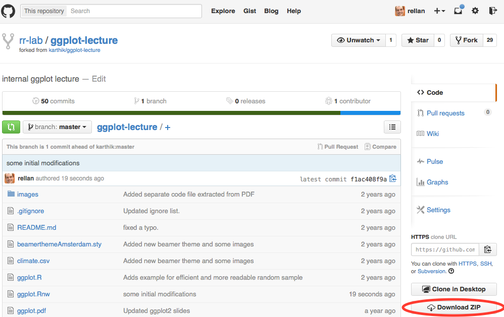

##Data Visualization with R and ggplot

First go here:

http://github.com/rrlab/ggplot-lecture}{github.com/rrlab/ggplot-lecture




Then install the following packages:


```{r}
install.packages("ggplot2", repos="http://cran.rstudio.com/")
install.packages("dplyr", repos="http://cran.rstudio.com/")
install.packages("tidyr", repos="http://cran.rstudio.com/")
install.packages("magrittr", repos="http://cran.rstudio.com/")
install.packages("RColorBrewer", repos="http://cran.rstudio.com/")
```

And then load them:

```{r}
library("ggplot2")
library("dplyr")
library("tidyr")
library("magrittr")
library("RColorBrewer")
```

##Base graphics

- Ugly, laborious, and verbose

- There are better ways to describe statistical visualizations

## ggplot2

- Follows a grammar, just like any language.

- It defines basic components that make up a sentence. In this case, the grammar defines components in a plot.
- Grammar of graphics originally coined by Lee Wilkinson ggplot : **g**ramar of **g**raphics plot
- Implemented in R by Hadley Wickham 


## Why ggplot2?

- Supports a continuum of expertise. 
- Get started right away but with practice you can effortless build complex, publication quality figures.

## Basics

### Some terminology


- **ggplot** The main function where you specify the dataset and variables to plot

- **geoms** geometric objects
  - geom_point(), geom_bar(), geom_density(), geom_line(), geom_area()
    
- **aes** aesthetics
  - shape, transparency (alpha), color, fill, linetype.

- **scales**  Define how your data will be plotted
  -continuous, discrete, log
  
## Assembling your first ggplot

### The iris dataset


```{r}
head(iris)

tail(iris)

glimpse(iris)
```

### Let's try an example

```{r}
ggplot(data = iris, aes(x = Sepal.Length, y = Sepal.Width)) +
  geom_point()
```

### Basic structure

```{r}
ggplot(data = iris, aes(x = Sepal.Length, y = Sepal.Width)) + 
  geom_point()
myplot <- ggplot(data = iris, aes(x = Sepal.Length, y = Sepal.Width))
myplot + geom_point()
```

- Specify the data and variables inside the **ggplot** function.
- Anything else that goes in here becomes a global setting.
- Then add layers of geometric objects, statistical models, and panels.

### Alternative modes to say the same thing

```{r}
ggplot(iris, aes(x = Sepal.Length, y = Sepal.Width)) +
  geom_point()

iris %>%
ggplot(aes(x = Sepal.Length, y = Sepal.Width)) +
  geom_point()
```

### Quick notes

- Never use *qplot* - short for quick plot.
- You'll end up unlearning and relearning a good bit.
- Check the name of your variables Sepal.length is not sepal.length is not SepalLength
- Be consistent with your variable naming. I like sepal_length
- Have you closed all your parenthesis? This:


ggplot(iris, aes(x = Sepal.Length, y = Sepal.Width) +
         geom_point()

won´t work.

### Let´s do some modifications

Increase the size of points

```{r}
ggplot(data = iris, aes(x = Sepal.Length, y = Sepal.Width)) +
  geom_point(size = 3)
```

Add some color

```{r}
ggplot(iris, aes(Sepal.Length, Sepal.Width, color = Species)) +
  geom_point(size = 3)
```

Differentiate points by shape

```{r}
ggplot(iris, aes(Sepal.Length, Sepal.Width, color = Species)) +
  geom_point(aes(shape = Species), size = 3)
```

### Exercise 1

Make a small sample of the diamonds dataset

```{r}
d2 <- diamonds[sample(1:dim(diamonds)[1], 1000), ]
```

Then generate the graph below:

```{r, echo=FALSE}
ggplot(d2, aes(carat, price, color = color)) + 
  geom_point()
```

## Box plots

```{r}
ggplot(iris, aes(Species, Sepal.Length)) + 
  geom_boxplot()
```

What if you also want to see all the individual points?

This is where the ggplot excels.

```{r}
ggplot(iris, aes(Species, Sepal.Length)) +
geom_boxplot() +
geom_point(position = "jitter")
```

## Histograms

```{r}
h <- ggplot(faithful, aes(x = waiting))
h + geom_histogram(binwidth = 30, colour = "black")
```

```{r}
h + geom_histogram(binwidth = 8, fill = "steelblue",
colour = "black")
```

## Line plots

```{r}
climate <- read.csv("climate.csv", header = T)
ggplot(climate, aes(Year, Anomaly10y)) +
geom_line()
```

We can also plot confidence regions

```{r}
ggplot(climate, aes(Year, Anomaly10y)) +
  geom_ribbon(aes(ymin = Anomaly10y - Unc10y,
                  ymax = Anomaly10y + Unc10y),
              fill = "blue", alpha = .1) +
  geom_line(color = "steelblue")

```

## Bar plots

```{r}
ggplot(iris, aes(Species, Sepal.Length)) +
geom_bar(stat = "identity")
```

## tidyr and dplyr are key for preparing data into ggplot friendly format.

- dplyr
  - select
  - filter
  - mutate
  - summarise
  - arrange
- tidyr}.
  - gather
  - separate
  - spread

```{r}
head(iris)
df <- gather(iris, organ, value, -Species)
head(iris)
```

```{r}
ggplot(df, aes(Species, value, fill = organ)) +
geom_bar(stat = "identity", position = "dodge")
```

## Exercise 
Using the d2 dataset you created earlier, generate this plot below. Take a quick look at the data first to see if it needs to be binned.

```{r, echo=FALSE}

ggplot(d2, aes(clarity, fill = cut)) +
  geom_bar(position = "dodge",stat = "bin")

```

## Exercise

Using the climate dataset, create a new variable called sign. Make it logical (true/false) based on the sign of Anomaly10y.

```{r, echo=FALSE}
climate <- climate %>%
  mutate(sign = Anomaly10y <0)
ggplot(climate, aes(Year, Anomaly10y)) + 
  geom_bar(stat = "identity", aes(fill = sign))

```

## Density Plots

```{r}
ggplot(faithful, aes(waiting)) + 
  geom_density()
```

some polishing

```{r}
ggplot(faithful, aes(waiting)) +
  geom_density(fill = "blue", alpha = 0.1)
```

another way to do the same

```{r}
ggplot(faithful, aes(waiting)) +
  geom_line(stat = "density")
```

## Mapping Variables to colors

Different ways to specify colors:

- aes(color = variable)
- aes(color = "black")

Or add it as a scale

- scale_fill_manual(values = c("color1", "color2"))

### The RColorBrewer package

```{r}
display.brewer.all()
```

### Using a color brewer palette

```{r}
df  <- gather(iris, organ, measurement, -Species)
ggplot(df, aes(Species, measurement, fill = organ)) +
geom_bar(stat = "identity", position = "dodge") +
scale_fill_brewer(palette = "Set1")
```

### Manual color scale

```{r}
ggplot(iris, aes(Sepal.Length, Sepal.Width, color = Species)) +
  geom_point() +
  scale_color_manual(values = c("red", "green", "blue"))

```

### Refer to a color chart for beautiful visualizations

[I want hue](http://tools.medialab.sciences-po.fr/iwanthue/)


## Faceting

Facets allow you to keep your graphs clean and easy to read. Very useful in time series data.

Faceting along columns

```{r}
ggplot(iris, aes(Sepal.Length, Sepal.Width, color = Species)) +
geom_point() +
facet_grid(Species ~ .)
```

and along rows

```{r}
ggplot(iris, aes(Sepal.Length, Sepal.Width, color = Species)) +
  geom_point() +
  facet_grid(. ~ Species)
```

## Adding smoothers

```{r}
ggplot(iris, aes(Sepal.Length, Sepal.Width, color = Species)) +
  geom_point(aes(shape = Species), size = 3) +
  geom_smooth(method = "lm")
```

here we have a typical example where facetting will be usefull

```{r}
ggplot(iris, aes(Sepal.Length, Sepal.Width, color = Species)) +
  geom_point(size = 3) +
  geom_smooth(method = "lm") +
  facet_grid(. ~ Species)
```

## Themes

Themes are a great way to define custom plots

A themed plot

```{r}
ggplot(iris, aes(Sepal.Length, Sepal.Width, color = Species)) +
  geom_point(size = 1.2, shape = 16) +
  facet_wrap( ~ Species) +
  theme(legend.key = element_rect(fill = NA),
        legend.position = "bottom",
        strip.background = element_rect(fill = NA),
        axis.title.y = element_text(angle = 0))
```

### ggthemes library

```{r}
install.packages('ggthemes', repos="http://cran.rstudio.com/")
library(ggthemes)

plot <- ggplot(iris, aes(Sepal.Length, Sepal.Width, color = Species)) +
  geom_point(size = 1.2, shape = 16) +
  facet_wrap( ~ Species)

# Then add one of these themes to your plot

plot + theme_stata()
plot + theme_excel()
plot + theme_wsj()
plot + theme_solarized()
plot + theme_gdocs()
plot + theme_economist()
```

## Create functions to automate your plotting


my_custom_plot <- function(df, title = "", ...) {
    ggplot(df, ...) +
    ggtitle(title) +
    whatever_geoms() +
    theme(...)


Then just call your function to generate a plot.
It's a lot easier to fix one function that do it over and over for many plots


plot1 <- my_custom_plot(dataset1, title = "Figure 1")


## Scales

```{r}
scale_fill_discrete(); scale_colour_discrete()
scale_fill_hue(); scale_color_hue()
scale_fill_manual();  scale_color_manual()
scale_fill_brewer(); scale_color_brewer()
scale_linetype(); scale_shape_manual()
```

## Gradients

```{r}
h + geom_histogram( aes(fill = ..count..), color="black") +
scale_fill_gradient(low="green", high="red")
```

## Publication quality figures

If the plot is in your screen:

```{r}
ggsave('filename.png')
```

If the plot is assigned to an object
```{r}
plot1 <-ggplot(data = iris, aes(x = Sepal.Length, y = Sepal.Width)) +
  geom_point()
ggsave(plot1, file = "filename.png")
```

Specify a size

```{r}
ggsave(file = "filename.png", width = 6, height =4) # default units in inches

```

Or any format (pdf, png, eps, svg, jpg)

```{r}
ggsave(file = "filename.eps")
ggsave(file = "filename.jpg")
ggsave(file = "filename.pdf") # preferred format for final publication images

```

This is just the beginning, you can do much more complicated things:

```{r}

install.packages("gridExtra", repos="http://cran.rstudio.com/")
library(gridExtra)

seg <- read.csv("soil-data.csv")
seg$humidity <- 221.0 - (3.96 * seg$environment)
seg$das <- substr(seg$image, start = 4, stop = 5)
seg$treatment <- substr(seg$image, start = 11, stop = 12)

scatter <- ggplot(data = seg, aes(x = direction, y = humidity)) +
  geom_point(aes(colour=treatment), size=2, alpha=0.7) +
  ylim(35, 80)+
  geom_density2d(aes(color=treatment))+
  ylab("Moisture content [%]") + 
  xlab("Root direction [°]") +
  theme_bw() +
  theme(legend.position=c(1,1),legend.justification=c(1,1))

histogram_x <- ggplot(data = seg, aes(direction)) +
  geom_density(aes(colour = treatment, fill = treatment, alpha = 0.7)) +
  xlab("Root Direction [º]") +
  theme_bw() +
  theme(legend.position = "none") 

histogram_y <- ggplot(data = seg, aes(humidity)) +
  geom_density(aes(colour = treatment, fill = treatment, alpha = 0.7)) +
  xlab("Moisture content [%]") +
  xlim(35, 80) +
  coord_flip() +
  theme_bw() +
  theme(legend.position = "none") 

empty <- ggplot()+geom_point(aes(1,1), colour="white") +
     theme(                              
       plot.background = element_blank(), 
       panel.grid.major = element_blank(), 
       panel.grid.minor = element_blank(), 
       panel.border = element_blank(), 
       panel.background = element_blank(),
       axis.title.x = element_blank(),
       axis.title.y = element_blank(),
       axis.text.x = element_blank(),
       axis.text.y = element_blank(),
       axis.ticks = element_blank()
     )

grid.arrange(histogram_x, empty, scatter, histogram_y, ncol=2, nrow=2, widths=c(3.5, 1), heights=c(1, 3.5))

```


## Further help

- You've just scratched the surface with ggplot2.
- Practice
- Read the docs (either locally in \texttt{R} or at 
- http://docs.ggplot2.org/current/
- Work together
- stackedit
 


